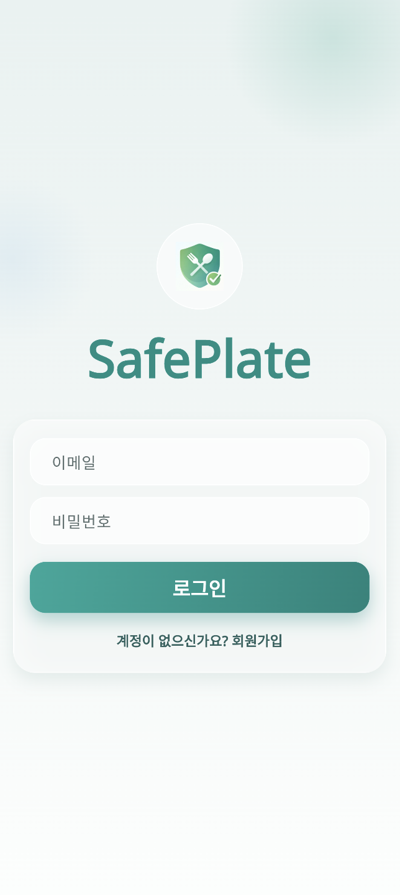
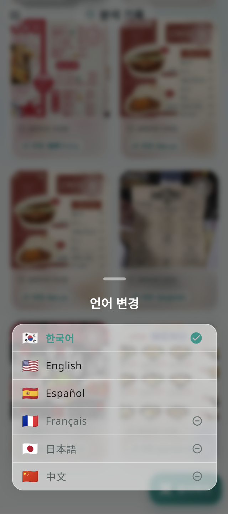
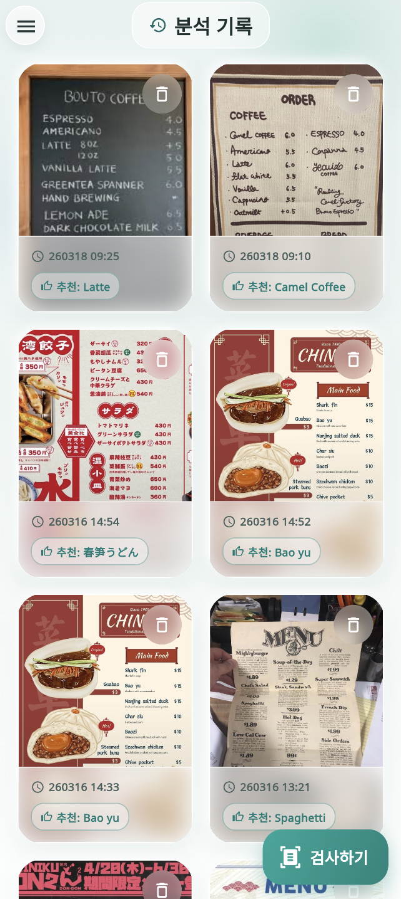
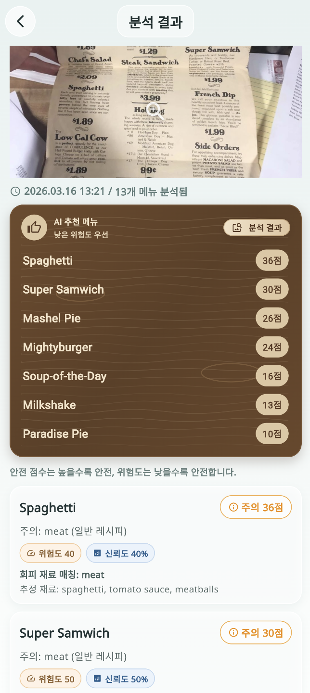
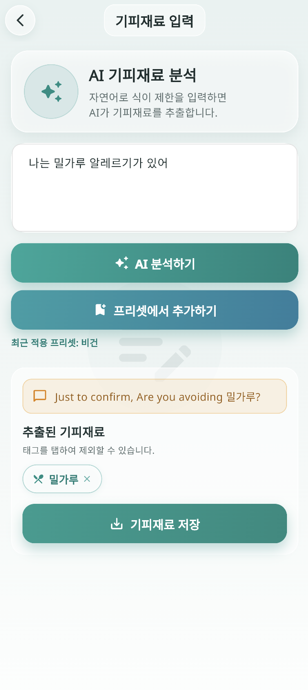
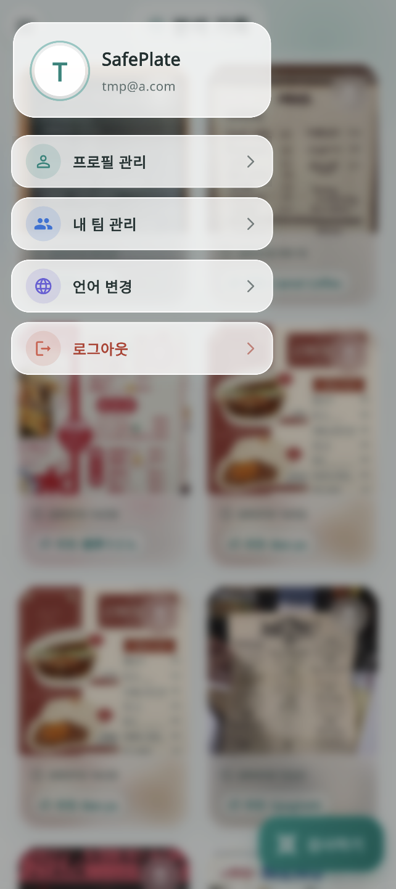

# SafePlate Frontend

SafePlate는 개인/팀의 기피 재료(알러지, 종교, 식습관)를 반영해 메뉴판을 분석하고, 더 안전한 메뉴 선택을 돕는 Flutter 앱입니다.

## 프로젝트 마무리 요약
- 인증, 팀, 기피재료 관리, 메뉴 분석, 분석 기록까지 사용자 흐름을 완성했습니다.
- 다국어 지원(`ko`, `en`, `es`, `fr`, `ja`, `zh`) 및 주요 화면 UI 톤을 통일했습니다.
- 빈 상태 UX와 프로필/팀 관리 화면을 정리해 최종 데모 품질로 마감했습니다.

## 화면 미리보기
| 로그인 | 언어 설정 |
| --- | --- |
|  |  |

| 분석 기록 | 분석 결과 |
| --- | --- |
|  |  |

| 기피재료 관리 | 사이드바 |
| --- | --- |
|  |  |

## 핵심 기능
- 이메일 기반 회원가입/로그인
- 개인 기피재료 입력 및 저장, 목록 관리
- 팀 생성/참여 및 팀 기준 분석
- 메뉴판 이미지 분석 요청 및 결과 확인
- 분석 기록 조회/삭제

## 기술 스택
- `Flutter`, `Dart`
- 상태관리: `flutter_riverpod`
- 라우팅: `go_router`
- 네트워크: `dio`
- 로컬 보안 저장소: `flutter_secure_storage`
- 다국어: `easy_localization`

## 실행 방법
### 1) 의존성 설치
```bash
flutter pub get
```

### 2) 환경 변수 설정
프로젝트 루트의 `.env`에 API 주소를 설정합니다.

```env
BASE_URL=http://localhost:8080
```

### 3) 앱 실행
```bash
flutter run
```

### 웹 디버깅 실행(CORS 우회)
```bash
flutter run -d chrome --web-browser-flag "--disable-web-security"
```

## 빌드
### Android APK
```bash
flutter build apk --release
```

주의: 로컬에 Android SDK가 설치되어 있고 `ANDROID_HOME` 또는 `ANDROID_SDK_ROOT`가 설정되어 있어야 합니다.

## 프로젝트 구조
```text
lib/
  core/         # 공통 설정, 라우터, 네트워크
  features/     # 도메인별 기능(auth, home, team, avoid_item, menu, history 등)
  shared/       # 공용 위젯
assets/
  translations/ # 다국어 리소스
  image/        # 앱 내 이미지 리소스
image/          # README용 스크린샷
```

## 마무리
SafePlate Frontend는 실제 사용자 시나리오를 기준으로 기능과 UI를 정리해 배포 가능한 상태까지 완성했습니다.
