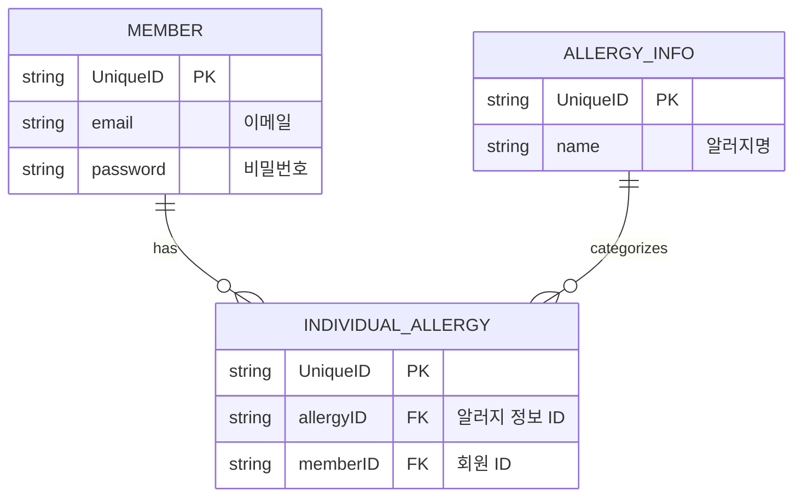

# SafePlate
여행중에 언어와 문화, 소통이 어려운 상황에서, 사용자의 알러지, 종교, 질병을 고려해, 안전한 식당을 추천하는 서비스

## 화면 구현
### 로그인 화면 (초기화면)
로그인 시에 아래 정보 입력
- 이메일
- 비밀번호

#### 버튼
- 로그인 버튼
- 회원가입 버튼

### 회원가입 화면
회원가입시에 아래 정보 3개 입력
- 이름
- 이메일
- 비밀번호

#### 버튼
- 회원가입 버튼

### 사용자 프로필 (기피 재료) 기록 화면

- 알러지
    - 체크리스트 (DB에서 현재 저장된 알러지 리스트 가져오도록 하면 될듯)

- 종교
    - 체크리스트 (현재 미구현)

- 질병
    - 체크리스트 (현재 미구현)

- 개인적 기호 및 회피 식재료
    - 체크리스트 (현재 미구현)

### 사용자 프로필 조회 화면

- 기피 재료 목록
- 수정 → 삭제 및 추가

### 검색 화면

검색중에 이전 검색기록으로 화면을 덮고

현재 위치에서 xx개 검색중입니다… 텍스트하단에 

### 검색 대기 화면

- 반경 x 미터 안에서 기피 재료를 반영한 식당을 검색하고 있습니다
- 카카오 택시 기다리는 화면 느낌

### 검색 결과 화면

- 식당 위치 마커, 이름, 추천하는 메뉴
- 왜 이 메뉴가 추천 됐는지
        - 너가 힌두교면 이거이거 안 먹는거 맞아?

### 사용자 프로필 조회 화면

- 기피 재료 목록?
- 수정 → 삭제 및 추가

### 검색 화면

검색중에 이전 검색기록으로 화면을 덮고

현재 위치에서 xx개 검색중입니다… 텍스트하단에 

### 검색 대기 화면

- 반경 x 미터 안에서 기피 재료를 반영한 식당을 검색하고 있습니다
- 카카오 택시 기다리는 화면 느낌

### 검색 결과 화면

- 식당 위치 마커, 이름, 추천하는 메뉴
- 왜 이 메뉴가 추천 됐는지

## 현재 구현된 api
기능 이름,Method,URL,상태,Request Body
로그인,POST,/auth/login,✅ 완료,-
회원가입,POST,/auth/join,✅ 완료,-
식당 검색,POST,/restaurant/search,🔄 진행 중,"{""keyword"": ""라면"", ""lat"": 37.123, ""lng"": 127.123}"
알러지 목록 조회,GET,/allergies,✅ 완료,-
내 알러지 조회,GET,/my/allergies,✅ 완료,-
내 알러지 저장,PUT,/my/allergies,✅ 완료,"{""id"": [1, 2, 5]}"
S3 Presigned URL 발급,POST,/files/presigned-url,✅ 완료,"{""path"": ""menu_board_request"", ""fileType"": ""png""}"
S3 파일 상태 업데이트,PATCH,/files/{fileId}/status,✅ 완료,"{""fileStatus"": ""UPLOADED""}"
AI 메뉴 분석 (외부),POST,https://hn-ui-gdg-team-9.hf.space/rank,✅ 완료 (Frontend 직접 호출),"{""image_url"": ""..."", ""avoid"": [...]}"

### 식당 검색 (POST)

JSON

{
  "keyword": "라면",
  "lat": 37.123,
  "lng": 127.123
}

### 내 알러지 저장 (PUT)

JSON

{
  "id": [1, 2, 5]
}

### S3 Presigned URL 발급 (POST)
- **설명**: 파일 업로드를 위한 Presigned URL을 발급받습니다.
- **URL**: `/files/presigned-url`

JSON
{
  "path": "menu_board_request",
  "fileType": "png"
}

### S3 파일 상태 업데이트 (PATCH)
- **설명**: S3 업로드 완료 후 백엔드에 상태를 업데이트하고 접근 가능한 URL을 받습니다.
- **URL**: `/files/{fileId}/status`

JSON
{
  "fileStatus": "UPLOADED"
}

### AI 메뉴 분석 (POST - External)
- **설명**: Frontend에서 S3 업로드 완료 후 확보한 URL과 유저의 기피 재료를 AI 서비스에 직접 보냅니다.
- **URL**: `https://hn-ui-gdg-team-9.hf.space/rank`

JSON
{
  "image_url": "https://safeplate26.s3.ap-northeast-2.amazonaws.com/...",
  "avoid": ["계란", "땅콩", "고수"]
}

## ERD 참고용
